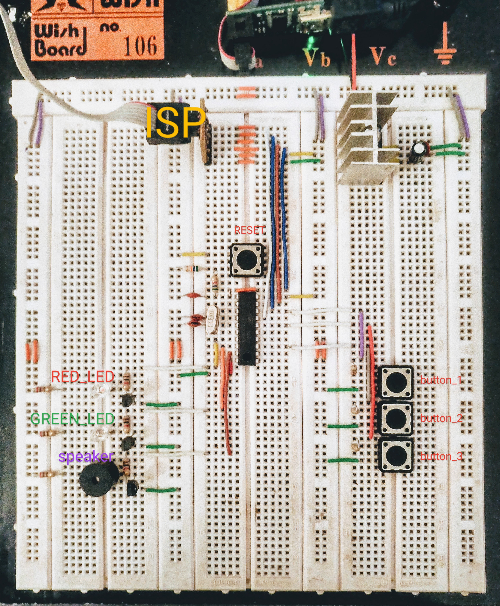

### Radio_morse_panel project prototype
To build project execute:
```bash
make
```
To check controller memory usage by firmware execute:
```bash
make
avr-size ./build/radio_morse.o --format=avr --mcu=attiny2313
```
Input buttons and output leds with speaker are marked with
labels.

